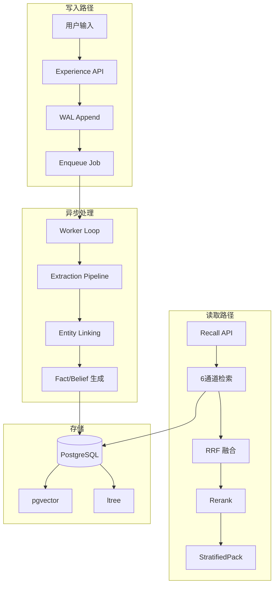
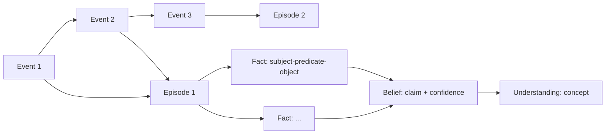
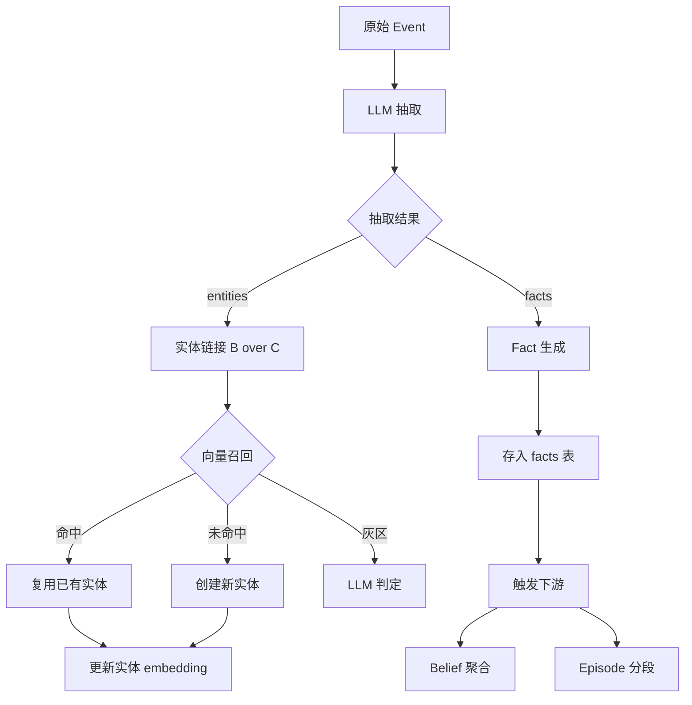

# 第0章 项目概览

## 项目定位

**Cortex-PY** 是 CortexDB 记忆系统的 Python 复刻实现。它不是一个生产级系统，而是面向个人/小团队可用的 Agent 长期记忆层。

```{admonition} 设计哲学
- **重点投入知识图谱质量**
- 不做集群/企业安全/benchmark 复现
- 五层记忆模型是核心
- 双时态三元组是灵魂
```

## 系统架构



## 五层记忆模型

| 层 | 存储 | 职责 |
|----|------|------|
| **Events** | `events` 表 | WAL，唯一真相源，不可变 append-only |
| **Episodes** | `episodes` 表 | 有界事件序列，按时间分段 |
| **Facts** | `facts` 表 | 双时态三元组，知识图谱的边 |
| **Beliefs** | `beliefs` 表 | 概率断言，带 supports 证据链 |
| **Understanding** | `understanding` 表 | 概念合成，从 beliefs 聚合 |



## 核心组件

### 1. 写入路径 (core.py)

```python
# core.py - 核心写入逻辑
def append_event(*, scope, modality, content, context, 
                 caller, idempotency_key, ...):
    """幂等写入：同 key+同 body → 返回既有; 同 key+异 body → 409"""
    # 1. 幂等检查
    existing = check_idempotency(scope, idempotency_key)
    if existing:
        if body_hash_match(existing, content):
            return existing  # 幂等返回
        raise IdempotencyConflict
    
    # 2. 写入 WAL
    event_id = insert_event(scope, modality, content, ...)
    
    # 3. 入队抽取任务
    enqueue_job("extract", event_id)
    
    # 4. 发送生命周期事件
    emit_lifecycle("captured", event_id)
    
    return event_id
```

### 2. 抽取管线 (extraction/pipeline.py)



### 3. 检索系统 (retrieval/pipeline.py)

6 通道混合检索：

| 通道 | 实现 | 说明 |
|------|------|------|
| 向量 | pgvector `<=>` | 实体 embedding 近邻 → 其 facts |
| BM25 | tsvector | facts/events 全文检索 |
| 图遍历 | 递归 CTE | 种子实体 BFS 2-3 跳 |
| Entity Name | pg_trgm | 模糊实体名匹配 |
| Synonym | entity_aliases | 别名匹配 |
| Temporal | 时间衰减 | 按 observed_at 加权 |

## 代码结构

```
src/cortex/
├── config.py          # YAML 配置 + 维度强校验
├── db.py              # engine / session / schema 初始化
├── core.py            # WAL append(幂等) + 队列 + lifecycle
├── services.py        # embedding / rerank / LLM 客户端
├── extraction/        # 抽取管线 + 实体链接 B over C
├── retrieval/         # 6 通道 + RRF + rerank + StratifiedPack
├── worker/            # Postgres-as-queue worker 循环
├── api/               # FastAPI 全端点
├── mcp_server.py      # MCP server（23 工具，双传输）
└── ...
```
