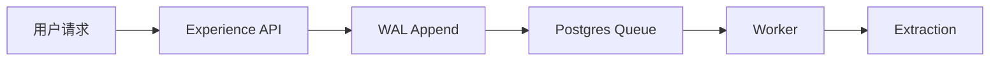
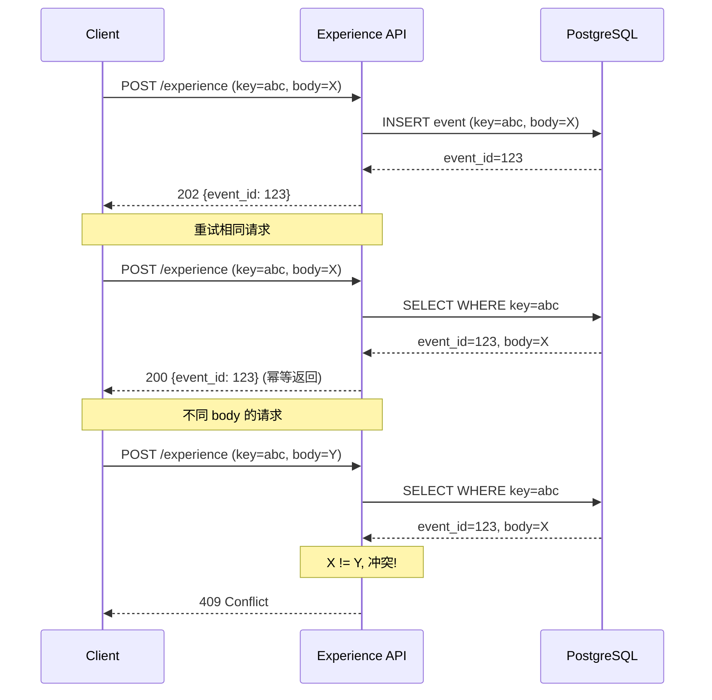
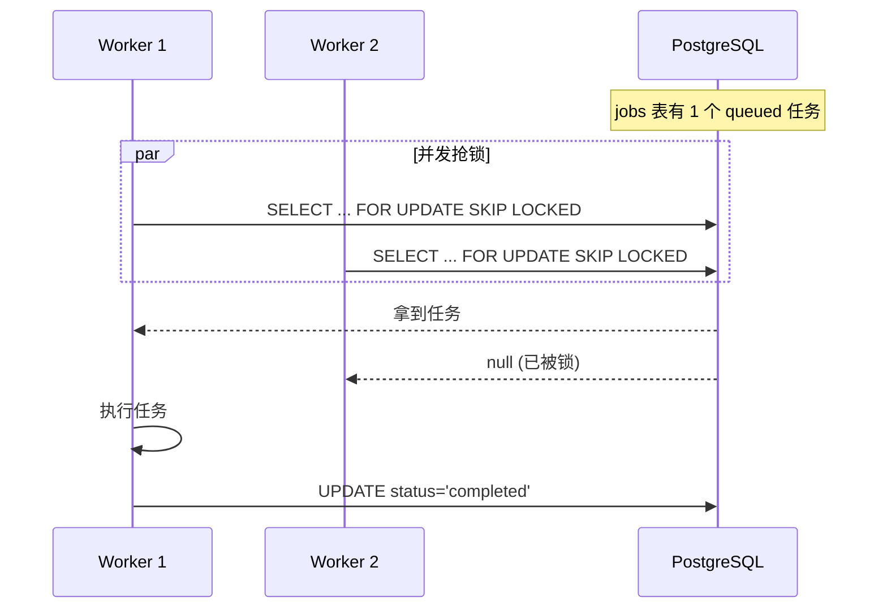
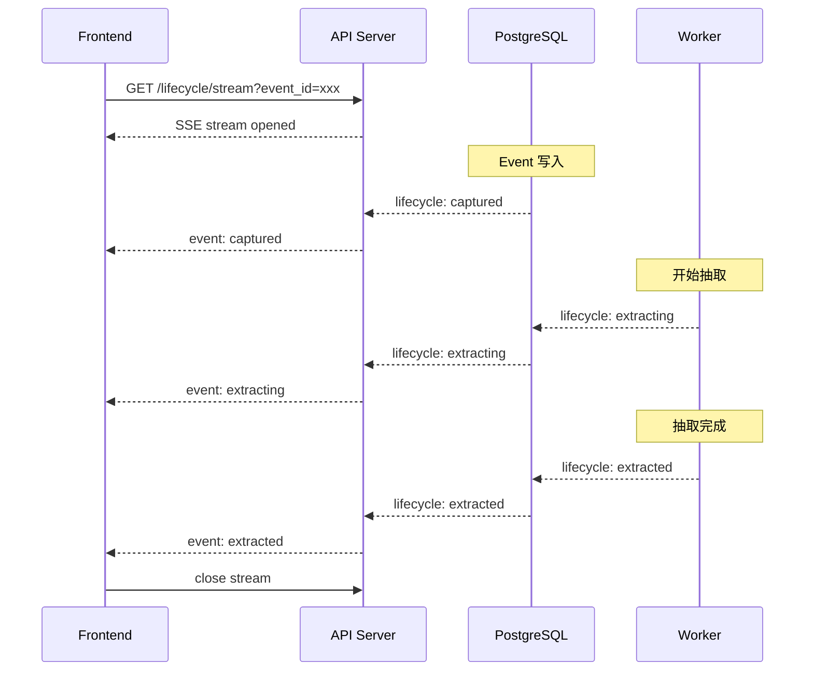
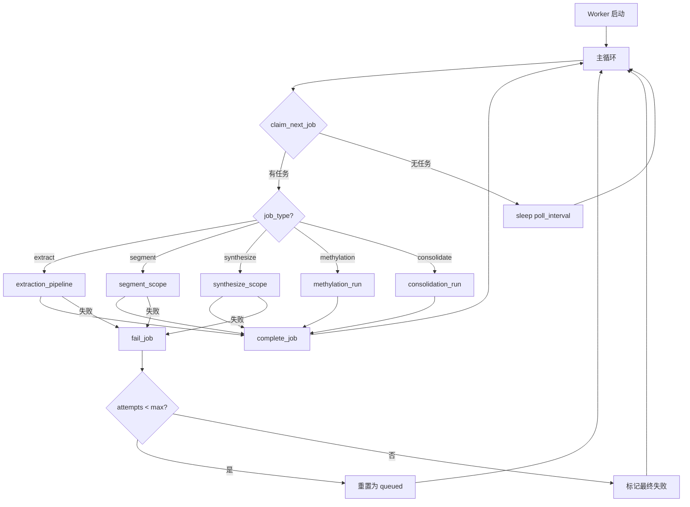
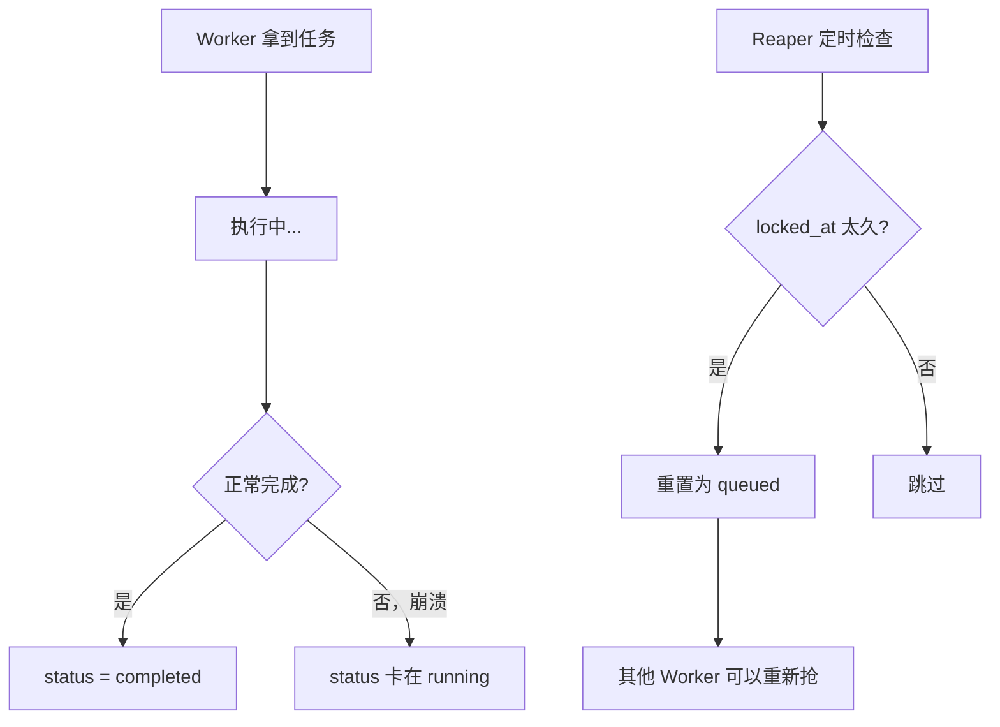

# 第3章 WAL 与事件系统

## 写入路径概述



## WAL (Write-Ahead Log)

### 设计原则

```{admonition} WAL 核心约束
1. **不可变** —— 一旦写入，永不修改
2. **Append-only** —— 只能追加，不能删除（除非 erasure）
3. **唯一真相源** —— 所有派生层从此重建
4. **幂等写入** —— 同 key 同 body 返回既有，不同 body 报错
```

### 幂等机制



### 实现代码

```python
# core.py
def append_event(*, scope, modality, content, context, 
                 caller, idempotency_key, ...):
    """幂等写入 Event"""
    
    with session_scope() as c:
        # 1. 幂等检查
        existing = c.execute(text(
            "SELECT event_id, wal_offset FROM events "
            "WHERE scope=:s AND idempotency_key=:k"
        ), {"s": scope, "k": idempotency_key}).fetchone()
        
        if existing:
            # 计算已有记录的 body hash
            existing_hash = c.execute(text(
                "SELECT encode(digest(:m||content::text||context::text,'sha256'),'hex') "
                "FROM events WHERE event_id=:id"
            ), {"m": modality, "id": existing.event_id}).scalar()
            
            # 计算新请求的 body hash
            new_hash = _body_hash(modality, content, context)
            
            if existing_hash == new_hash:
                # 同 key 同 body: 幂等返回
                return str(existing.event_id), existing.wal_offset
            else:
                # 同 key 不同 body: 冲突
                raise IdempotencyConflict(
                    f"idempotency_key={idempotency_key} 已存在且 body 不同"
                )
        
        # 2. 写入 WAL
        row = c.execute(text("""
            INSERT INTO events (
                scope, modality, content, context, 
                caller, observed_actor, subject,
                observed_at, directives, idempotency_key
            ) VALUES (
                :scope, :modality, 
                CAST(:content AS jsonb), 
                CAST(:context AS jsonb),
                :caller, :oa, :subj,
                COALESCE(:observed_at, now()), 
                CAST(:directives AS jsonb), 
                :ik
            )
            RETURNING event_id, wal_offset
        """), {
            "scope": scope,
            "modality": modality,
            "content": json.dumps(content),
            "context": json.dumps(context),
            "caller": caller,
            "oa": observed_actor or caller,
            "subj": subject or observed_actor or caller,
            "observed_at": observed_at,
            "directives": json.dumps(directives) if directives else None,
            "ik": idempotency_key
        }).fetchone()
        
        # 3. 自动 provision scope
        _auto_provision_scope(c, scope)
        
        # 4. 发送生命周期事件
        emit_lifecycle(c, kind="captured", 
                      scope=scope, event_id=row.event_id)
        
        # 5. 入队抽取任务
        _enqueue_extraction(c, row.event_id, scope)
        
        return str(row.event_id), row.wal_offset
```

## Postgres-as-Queue

### 为什么不用 Redis?

```{admonition} 设计决策
- **简单** —— 少一个依赖，少一个运维负担
- **事务一致** —— 写 WAL 和入队在同一事务
- **足够快** —— 个人/小团队规模，Postgres 完全够用
- **SKIP LOCKED** —— 高效的任务抢占
```

### 队列表

```sql
CREATE TABLE jobs (
    job_id        UUID PRIMARY KEY DEFAULT gen_random_uuid(),
    job_type      TEXT NOT NULL,  -- extract/segment/synthesize/methylation/consolidate
    scope         TEXT NOT NULL,
    event_id      UUID REFERENCES events(event_id),
    payload       JSONB,
    
    -- 状态机
    status        TEXT NOT NULL DEFAULT 'queued',  -- queued/running/completed/failed
    attempts      INTEGER NOT NULL DEFAULT 0,
    max_attempts  INTEGER NOT NULL DEFAULT 3,
    
    -- 时间
    created_at    TIMESTAMPTZ NOT NULL DEFAULT now(),
    locked_at     TIMESTAMPTZ,
    locked_by     TEXT,
    started_at    TIMESTAMPTZ,
    completed_at  TIMESTAMPTZ,
    
    -- 错误信息
    error         TEXT
);
```

### 任务抢占



**实现** (`core.py`):

```python
def claim_next_job(conn, worker_id: str) -> Optional[dict]:
    """抢占下一个 queued 任务"""
    row = conn.execute(text("""
        UPDATE jobs 
        SET status = 'running',
            locked_at = now(),
            locked_by = :wid,
            started_at = now(),
            attempts = attempts + 1
        WHERE job_id = (
            SELECT job_id FROM jobs
            WHERE status = 'queued'
              AND attempts < max_attempts
            ORDER BY created_at
            FOR UPDATE SKIP LOCKED
            LIMIT 1
        )
        RETURNING *
    """), {"wid": worker_id}).fetchone()
    
    return dict(row) if row else None
```

## Lifecycle 事件

### 用途

实时通知前端任务进度。



### Schema

```sql
CREATE TABLE lifecycle_events (
    event_id    UUID PRIMARY KEY DEFAULT gen_random_uuid(),
    scope       TEXT NOT NULL,
    kind        TEXT NOT NULL,  -- captured/extracting/extracted/segmented/...
    ref_id      UUID,           -- 关联的 event_id 或 job_id
    payload     JSONB,
    created_at  TIMESTAMPTZ NOT NULL DEFAULT now()
);

-- TTL: 只保留最近 24 小时
CREATE INDEX idx_lifecycle_created ON lifecycle_events (created_at DESC);
```

### 发送实现

```python
# core.py
def emit_lifecycle(conn, kind: str, scope: str, 
                   event_id: str = None, payload: dict = None):
    """发送生命周期事件"""
    conn.execute(text("""
        INSERT INTO lifecycle_events (scope, kind, ref_id, payload)
        VALUES (:s, :k, :r, CAST(:p AS jsonb))
    """), {
        "s": scope,
        "k": kind,
        "r": event_id,
        "p": json.dumps(payload) if payload else None
    })
```

## Worker 循环

### 整体流程



### Worker 实现

```python
# worker/runner.py
def run_worker(*, max_iterations: int = 0):
    """阻塞跑 worker"""
    cfg = load_config()
    worker_id = f"worker-{int(time.time()) % 100000}"
    poll = cfg.worker.poll_interval_secs
    vis = cfg.worker.visibility_timeout_secs
    
    log.info("worker %s started (poll=%.2fs vis=%ss)", 
             worker_id, poll, vis)
    
    while max_iterations == 0 or it < max_iterations:
        it += 1
        try:
            with session_scope() as conn:
                # 1. 抢任务
                job = claim_next_job(conn, worker_id)
                
                if not job:
                    # 没任务，sleep
                    conn.execute(text("SELECT pg_sleep(:s)"), {"s": poll})
                    continue
                
                # 2. 分发执行
                try:
                    result = _dispatch(job)
                    complete_job(conn, job["job_id"], result)
                except Exception as e:
                    fail_job(conn, job["job_id"], str(e))
                    
        except Exception:
            log.exception("worker loop error")
            time.sleep(1)
    
    log.info("worker %s exiting", worker_id)
```

### 任务分发

```python
def _dispatch(job: dict) -> dict:
    """按 job_type 跑对应 handler"""
    jt = job["job_type"]
    scope = job.get("scope")
    
    if jt == "extract" and job.get("event_id"):
        from ..extraction.pipeline import extract_event
        return extract_event(job["event_id"])
    
    if jt == "segment" and scope:
        from ..episodes import segment_scope
        return segment_scope(scope)
    
    if jt == "synthesize" and scope:
        from ..understanding import synthesize_scope
        return synthesize_scope(scope)
    
    if jt == "methylation" and scope:
        from ..maintenance import methylation_run
        return methylation_run(scope)
    
    if jt == "consolidate" and scope:
        from ..maintenance import consolidation_run
        return consolidation_run(scope)
    
    return {"ok": True, "note": f"no handler for {jt}"}
```

## Visibility Timeout & Reaper

### 问题

Worker 可能崩溃，导致任务卡在 `running` 状态。

### 解决方案



### Reaper 实现

```python
# core.py
def reap_zombies(conn, visibility_timeout: int = 300):
    """回收超时的 running 任务"""
    rows = conn.execute(text("""
        UPDATE jobs 
        SET status = 'queued',
            locked_at = NULL,
            locked_by = NULL
        WHERE status = 'running'
          AND locked_at < now() - make_interval(secs => :timeout)
        RETURNING job_id
    """), {"timeout": visibility_timeout}).fetchall()
    
    return len(rows)
```
