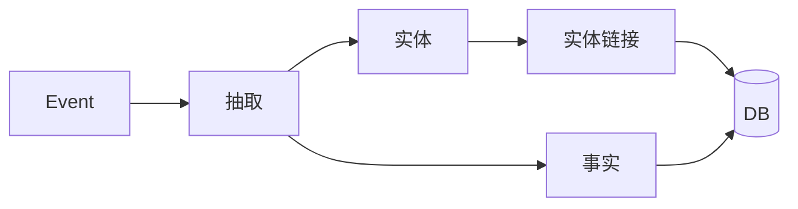
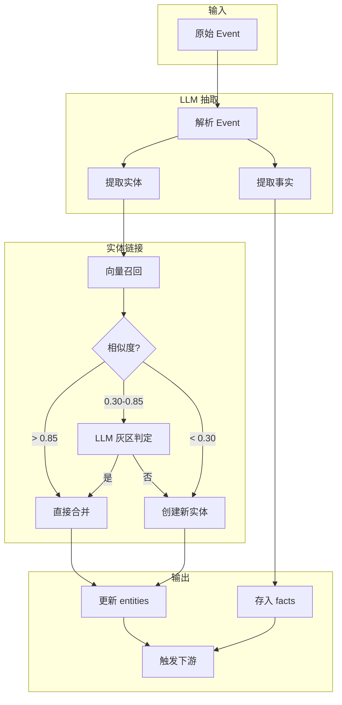
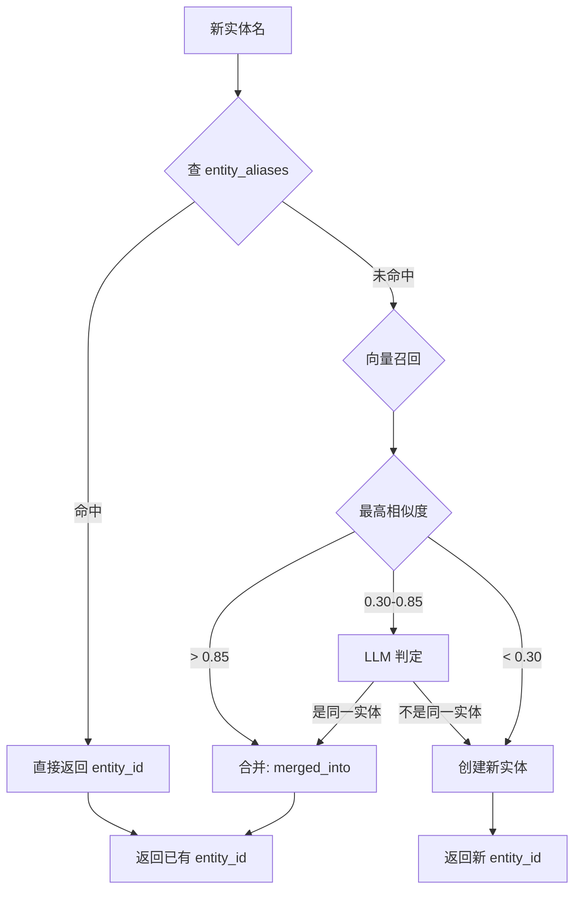
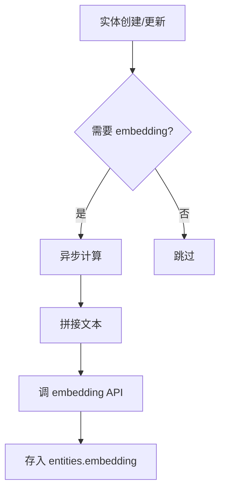
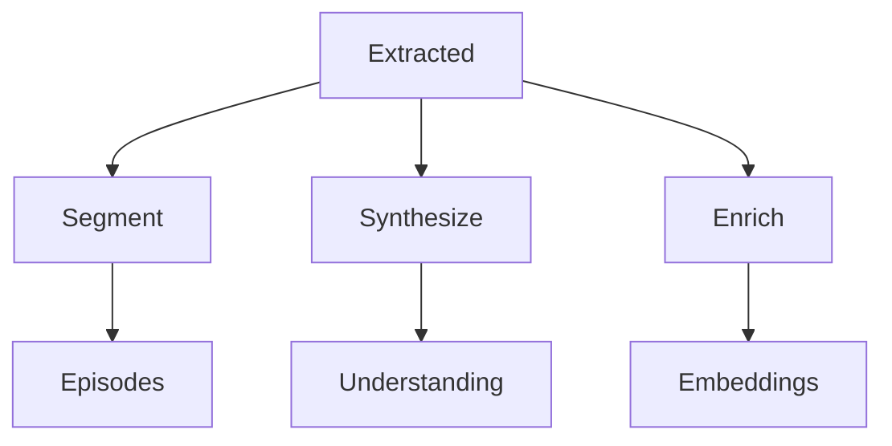

# 第4章 抽取管线

## 概述

抽取管线是系统的**核心处理层**，负责从原始 Event 中提取结构化知识。



## 抽取流程

### 整体架构



## LLM 抽取

### Prompt 设计

```python
EXTRACT_PROMPT = """
从以下对话中提取：
1. 实体 (entities): 人名、组织、概念等
2. 事实 (facts): subject-predicate-object 三元组

输出 JSON:
{
  "entities": [
    {
      "name": "实体名",
      "type": "person/org/concept",
      "description": "描述"
    }
  ],
  "facts": [
    {
      "subject": "实体名",
      "predicate": "关系",
      "object": "实体名或值",
      "confidence": 0.9
    }
  ]
}

对话内容:
{content}
"""
```

### Mock 抽取器

当没有 LLM key 时，使用**确定性 mock**：

```python
# extraction/pipeline.py
def mock_extract(content: str):
    """确定性 mock: 用规则解析"""
    entities = []
    facts = []
    
    # 简单规则: 提取大写开头的词作为实体
    import re
    words = re.findall(r'\b[A-Z][a-z]+\b', content)
    for w in set(words):
        entities.append({
            "name": w,
            "type": "person",
            "description": f"{w} (mock)"
        })
    
    # 简单规则: 提取 "X works at Y" 模式
    match = re.search(r'(\w+) works at (\w+)', content)
    if match:
        facts.append({
            "subject": match.group(1),
            "predicate": "works_at",
            "object": match.group(2),
            "confidence": 0.8
        })
    
    return {"entities": entities, "facts": facts}
```

### 真实 LLM 抽取

```python
# extraction/pipeline.py
def extract_with_llm(content: str) -> dict:
    """调 LLM 抽取"""
    cfg = load_config()
    
    # 检查是否有 LLM key
    if not llm_configured("extraction"):
        return mock_extract(content)
    
    # 调 LLM
    from .. import services
    result = services.llm_chat(
        tier="extraction",
        system=EXTRACT_PROMPT,
        user=content
    )
    
    # 解析 JSON
    return services.parse_llm_json(result)
```

## 抽取管线实现

### 主流程

```python
# extraction/pipeline.py
def extract_event(event_id: str) -> dict:
    """抽取单个 event 的完整流程"""
    
    with session_scope() as conn:
        # 1. 读取 event
        event = fetch_event(conn, event_id)
        if not event:
            return {"error": "event not found"}
        
        content = event["content"]
        scope = event["scope"]
        
        # 2. LLM 抽取
        extraction = extract_with_llm(
            content.get("text", "")
        )
        
        entities_created = []
        facts_created = []
        
        # 3. 处理实体
        for ent_data in extraction.get("entities", []):
            entity_id = link_entity(
                conn, scope, 
                ent_data["name"],
                ent_data.get("type"),
                ent_data.get("description")
            )
            entities_created.append(entity_id)
        
        # 4. 处理事实
        for fact_data in extraction.get("facts", []):
            # 链接 subject 和 object 实体
            subject_id = link_entity(
                conn, scope, fact_data["subject"]
            )
            
            object_id = None
            object_value = None
            
            # object 可能是实体或值
            if is_entity(fact_data["object"]):
                object_id = link_entity(
                    conn, scope, fact_data["object"]
                )
            else:
                object_value = {
                    "datatype": "string",
                    "value": fact_data["object"]
                }
            
            # 创建 fact
            fact_id = create_fact(
                conn, scope,
                subject_id=subject_id,
                predicate=fact_data["predicate"],
                object_entity_id=object_id,
                object_value=object_value,
                confidence=fact_data.get("confidence", 0.5),
                supports=[event_id]
            )
            facts_created.append(fact_id)
        
        # 5. 发送生命周期
        emit_lifecycle(conn, "extracted", scope, event_id)
        
        # 6. 触发下游任务
        enqueue_job(conn, "segment", scope)
        enqueue_job(conn, "synthesize", scope)
        
        return {
            "entities": len(entities_created),
            "facts": len(facts_created)
        }
```

## 实体链接 (B over C)

### 三层策略



### 向量召回

```python
# extraction/pipeline.py
def vector_recall(conn, scope, name, top_k=5):
    """向量召回相似实体"""
    # 计算查询向量
    from .. import services
    query_text = f"{name}"
    query_emb = services.embed_one(query_text)
    
    # pgvector 近邻查询
    rows = conn.execute(text("""
        SELECT 
            entity_id,
            canonical_name,
            1 - (embedding <=> CAST(:q AS vector)) as similarity
        FROM entities
        WHERE scope = :s 
          AND merged_into IS NULL
          AND embedding IS NOT NULL
        ORDER BY embedding <=> CAST(:q AS vector)
        LIMIT :k
    """), {"s": scope, "q": str(query_emb), "k": top_k}).fetchall()
    
    return rows
```

### LLM 灰区判定

```python
def llm_judge_linkage(name, candidate_name, candidate_desc):
    """LLM 判定两个实体是否相同"""
    prompt = f"""
    判断以下两个实体是否指代同一事物:
    
    实体 A: {name}
    实体 B: {candidate_name}
    描述: {candidate_desc}
    
    输出 JSON: {{"is_same": true/false, "reason": "..."}}
    """
    
    result = services.llm_chat("extraction", prompt, "")
    return services.parse_llm_json(result)
```

### 链接主函数

```python
def link_entity(conn, scope, name, entity_type=None, description=None):
    """B over C 实体链接"""
    
    # A 层: 查别名 (最快)
    alias_hit = conn.execute(text("""
        SELECT entity_id FROM entity_aliases 
        WHERE alias = :a AND scope = :s
    """), {"a": name, "s": scope}).fetchone()
    
    if alias_hit:
        return alias_hit.entity_id
    
    # B 层: 向量召回
    candidates = vector_recall(conn, scope, name, top_k=5)
    
    if not candidates:
        # C 层: 创建新实体
        return create_entity(conn, scope, name, entity_type, description)
    
    best = candidates[0]
    score = best.similarity
    
    # 高阈值: 直接合并
    cfg = load_config().extraction.link_thresholds
    if score > cfg.merge:
        return best.entity_id
    
    # 低阈值: 创建新实体
    if score < cfg.new:
        return create_entity(conn, scope, name, entity_type, description)
    
    # 灰区: LLM 判定
    if llm_configured("extraction"):
        judgment = llm_judge_linkage(
            name, best.canonical_name, best.description
        )
        if judgment.get("is_same"):
            return best.entity_id
    
    # 默认: 创建新实体
    return create_entity(conn, scope, name, entity_type, description)
```

## Embedding 计算

### 何时计算



### Embedding 文本格式

```python
# config.py
class ExtractionCfg(BaseModel):
    embedding_text: str = "{name}. {description}"
```

```python
def compute_entity_embedding(entity_id, name, description):
    """计算实体 embedding"""
    cfg = load_config().extraction
    text = cfg.embedding_text.format(
        name=name, 
        description=description or name
    )
    
    from .. import services
    embedding = services.embed_one(text)
    
    # 存入数据库
    with session_scope() as conn:
        conn.execute(text("""
            UPDATE entities 
            SET embedding = CAST(:e AS vector)
            WHERE entity_id = :id
        """), {"e": str(embedding), "id": entity_id})
```

## 下游触发

抽取完成后，触发多个下游任务：



```python
# 触发下游
def trigger_downstream(conn, scope, event_id):
    """抽取完成后触发下游任务"""
    # 1. 事件分段
    enqueue_job(conn, "segment", scope)
    
    # 2. 概念合成
    enqueue_job(conn, "synthesize", scope)
    
    # 3. 异步 KG 增强
    enqueue_job(conn, "enrich", scope)
```
