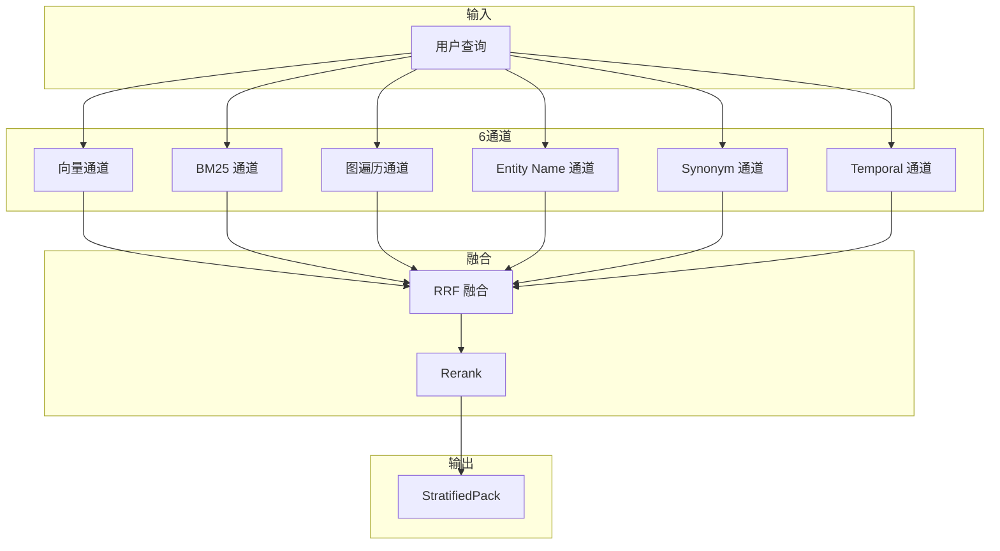
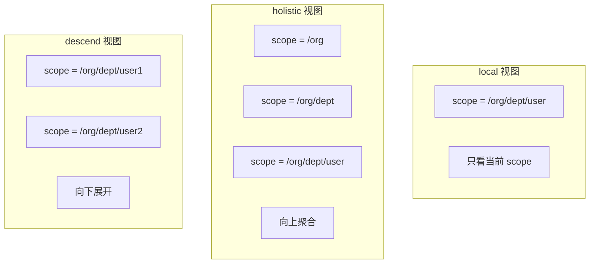
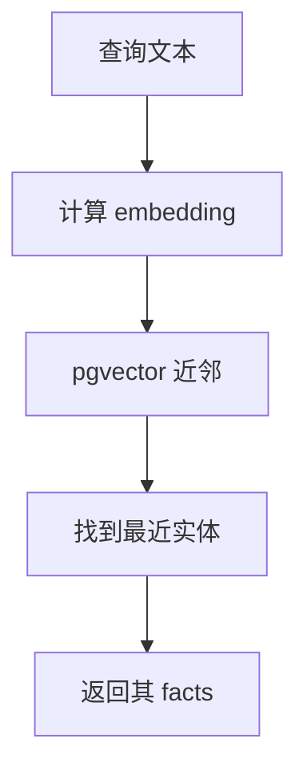
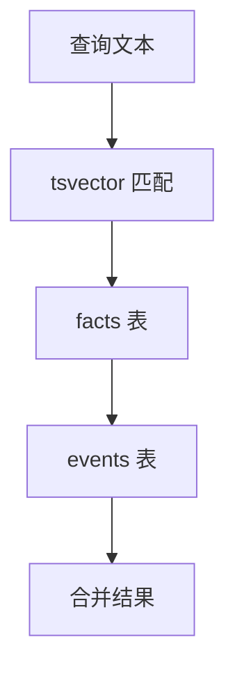
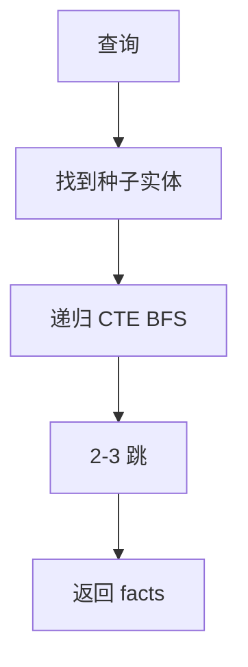
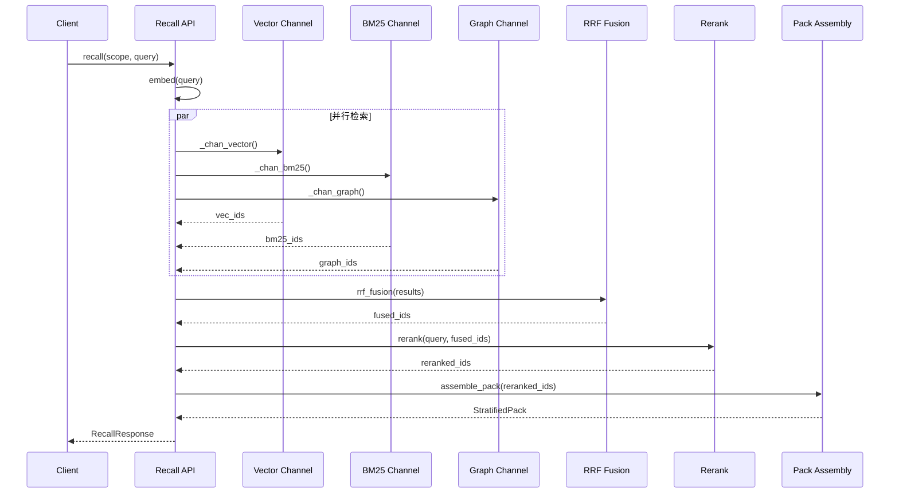

# 第6章 检索系统概述

## 设计目标

检索系统的核心目标是**从记忆中找到最相关的信息**，支持 6 通道混合检索。



## 6 通道详解

| 通道 | 实现 | 优势 | 劣势 |
|------|------|------|------|
| **向量** | pgvector `<=>` | 语义相似 | 对精确匹配弱 |
| **BM25** | tsvector | 精确关键词 | 对同义词弱 |
| **图遍历** | 递归 CTE | 关系推理 | 计算开销大 |
| **Entity Name** | pg_trgm | 模糊匹配 | 仅匹配名称 |
| **Synonym** | entity_aliases | 别名扩展 | 依赖别名表 |
| **Temporal** | 时间衰减 | 近期优先 | 对历史弱 |

## 查询入口

### Recall API

```python
# retrieval/pipeline.py
def recall(scope, query, view="local", top_k=40, ...):
    """6 通道混合检索"""
    
    # 1. 获取查询向量
    q_emb = services.embed_one(query)
    
    # 2. 并行跑 6 通道
    results = []
    
    with session_scope() as conn:
        # 向量通道
        vec_ids = _chan_vector(conn, scope, view, q_emb, top_k)
        results.append(("vector", vec_ids))
        
        # BM25 通道
        bm25_ids = _chan_bm25(conn, scope, view, query, top_k)
        results.append(("bm25", bm25_ids))
        
        # 图遍历通道
        graph_ids = _chan_graph(conn, scope, view, q_emb, top_k)
        results.append(("graph", graph_ids))
        
        # Entity Name 通道
        name_ids = _chan_entity_name(conn, scope, view, query, top_k)
        results.append(("entity_name", name_ids))
        
        # Synonym 通道
        syn_ids = _chan_synonym(conn, scope, view, query, top_k)
        results.append(("synonym", syn_ids))
        
        # Temporal 通道
        temp_ids = _chan_temporal(conn, scope, view, top_k)
        results.append(("temporal", temp_ids))
    
    # 3. RRF 融合
    fused = rrf_fusion(results)
    
    # 4. 取 top-N
    top_n = fused[:top_k]
    
    # 5. Rerank
    reranked = rerank_results(query, top_n)
    
    # 6. 组装 StratifiedPack
    pack = assemble_pack(conn, scope, reranked)
    
    return pack
```

## Scope 视图

### 三种视图



### 实现

```python
def _scope_filter(scope, view):
    """返回 (SQL fragment, params)"""
    if view == "holistic":
        # 向上聚合: 生成所有前缀
        prefixes = [
            "/".join(scope.split("/")[:i]) 
            for i in range(1, len(scope.split("/")) + 1)
        ]
        return "scope = ANY(:scopes)", {"scopes": prefixes}
    
    elif view == "descend":
        # 向下展开: 匹配所有子 scope
        return (
            "(scope = :scope0 OR scope LIKE :scopep)",
            {"scope0": scope, "scopep": scope + "/%"}
        )
    
    else:
        # 精确匹配
        return "scope = :scope0", {"scope0": scope}
```

## 通道 1: 向量通道

### 原理



### 实现

```python
def _chan_vector(conn, scope, view, q_emb, top_k):
    """向量通道: query embedding → 最近实体 → 其 live facts"""
    frag, p = _scope_filter(scope, view)
    p["q"] = str(q_emb)
    p["k"] = top_k
    
    sql = f"""
        WITH near AS (
            -- 1. 找最近实体
            SELECT entity_id 
            FROM entities
            WHERE merged_into IS NULL 
              AND embedding IS NOT NULL 
              AND {frag}
            ORDER BY embedding <=> CAST(:q AS vector) 
            LIMIT :k
        )
        -- 2. 返回其 live facts
        SELECT DISTINCT f.fact_id::text 
        FROM facts f
        WHERE f.{frag} 
          AND f.valid_to IS NULL 
          AND f.recorded_to IS NULL
          AND (
            f.subject_id IN (SELECT entity_id FROM near)
            OR f.object_entity_id IN (SELECT entity_id FROM near)
          )
        LIMIT :k
    """
    
    return [r[0] for r in conn.execute(text(sql), p).fetchall()]
```

## 通道 2: BM25 通道

### 原理



### 实现

```python
def _chan_bm25(conn, scope, view, query, top_k):
    """BM25 通道: tsvector 全文检索"""
    frag, p = _scope_filter(scope, view)
    p["q"] = query
    p["k"] = top_k
    
    # 搜索 facts
    sql_facts = f"""
        SELECT fact_id::text
        FROM facts
        WHERE {frag}
          AND valid_to IS NULL
          AND recorded_to IS NULL
          AND content_tsv @@ plainto_tsquery('english', :q)
        ORDER BY ts_rank(content_tsv, plainto_tsquery('english', :q)) DESC
        LIMIT :k
    """
    
    fact_ids = [r[0] for r in conn.execute(text(sql_facts), p).fetchall()]
    
    # 搜索 events
    sql_events = f"""
        SELECT event_id::text
        FROM events
        WHERE {frag}
          AND content->>'text' @@ plainto_tsquery('english', :q)
        ORDER BY ts_rank(
            to_tsvector('english', content->>'text'), 
            plainto_tsquery('english', :q)
        ) DESC
        LIMIT :k
    """
    
    event_ids = [r[0] for r in conn.execute(text(sql_events), p).fetchall()]
    
    return fact_ids + event_ids
```

## 通道 3: 图遍历通道

### 原理



### 实现

```python
def _chan_graph(conn, scope, view, q_emb, top_k, max_hops=2):
    """图遍历通道: 种子实体 BFS"""
    frag, p = _scope_filter(scope, view)
    p["q"] = str(q_emb)
    p["k"] = top_k
    p["hops"] = max_hops
    
    sql = f"""
        WITH RECURSIVE 
        -- 1. 种子实体 (向量最近)
        seeds AS (
            SELECT entity_id
            FROM entities
            WHERE merged_into IS NULL 
              AND embedding IS NOT NULL 
              AND {frag}
            ORDER BY embedding <=> CAST(:q AS vector)
            LIMIT 5
        ),
        -- 2. 递归 BFS
        graph_walk AS (
            -- 种子层
            SELECT 
                f.fact_id,
                f.subject_id,
                f.object_entity_id,
                0 as depth
            FROM facts f
            JOIN seeds s ON (
                f.subject_id = s.entity_id 
                OR f.object_entity_id = s.entity_id
            )
            WHERE f.{frag}
              AND f.valid_to IS NULL
            
            UNION ALL
            
            -- 递归层
            SELECT 
                f.fact_id,
                f.subject_id,
                f.object_entity_id,
                gw.depth + 1
            FROM facts f
            JOIN graph_walk gw ON (
                f.subject_id = gw.object_entity_id 
                OR f.object_entity_id = gw.subject_id
                OR f.subject_id = gw.subject_id
                OR f.object_entity_id = gw.object_entity_id
            )
            WHERE gw.depth < :hops
              AND f.{frag}
              AND f.valid_to IS NULL
        )
        -- 3. 去重返回
        SELECT DISTINCT fact_id::text 
        FROM graph_walk
        LIMIT :k
    """
    
    return [r[0] for r in conn.execute(text(sql), p).fetchall()]
```

## 通道 4: Entity Name 通道

### 原理

使用 pg_trgm 做模糊匹配。

```python
def _chan_entity_name(conn, scope, view, query, top_k):
    """Entity Name 通道: pg_trgm 模糊匹配"""
    frag, p = _scope_filter(scope, view)
    p["q"] = query
    p["k"] = top_k
    
    sql = f"""
        SELECT DISTINCT f.fact_id::text
        FROM facts f
        JOIN entities e ON (
            f.subject_id = e.entity_id 
            OR f.object_entity_id = e.entity_id
        )
        WHERE f.{frag}
          AND f.valid_to IS NULL
          AND e.canonical_name % :q
        ORDER BY similarity(e.canonical_name, :q) DESC
        LIMIT :k
    """
    
    return [r[0] for r in conn.execute(text(sql), p).fetchall()]
```

## 通道 5: Synonym 通道

### 原理

通过 entity_aliases 查找别名匹配。

```python
def _chan_synonym(conn, scope, view, query, top_k):
    """Synonym 通道: 别名匹配"""
    frag, p = _scope_filter(scope, view)
    p["q"] = query
    p["k"] = top_k
    
    sql = f"""
        SELECT DISTINCT f.fact_id::text
        FROM facts f
        JOIN entity_aliases a ON (
            f.subject_id = a.entity_id 
            OR f.object_entity_id = a.entity_id
        )
        WHERE f.{frag}
          AND f.valid_to IS NULL
          AND a.alias % :q
        ORDER BY similarity(a.alias, :q) DESC
        LIMIT :k
    """
    
    return [r[0] for r in conn.execute(text(sql), p).fetchall()]
```

## 通道 6: Temporal 通道

### 原理

按时间衰减加权，近期优先。

```python
def _chan_temporal(conn, scope, view, top_k):
    """Temporal 通道: 时间衰减"""
    frag, p = _scope_filter(scope, view)
    p["k"] = top_k
    
    sql = f"""
        SELECT fact_id::text
        FROM facts
        WHERE {frag}
          AND valid_to IS NULL
          AND recorded_to IS NULL
        ORDER BY 
            -- 时间衰减: 近期权重高
            EXP(-EXTRACT(EPOCH FROM (now() - recorded_from)) / 86400.0) DESC,
            recorded_from DESC
        LIMIT :k
    """
    
    return [r[0] for r in conn.execute(text(sql), p).fetchall()]
```

## 完整流程图


