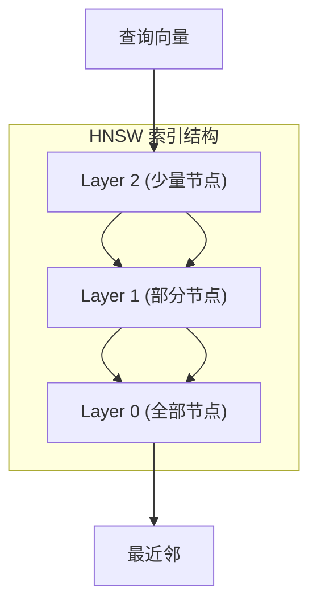
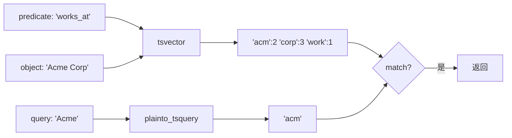
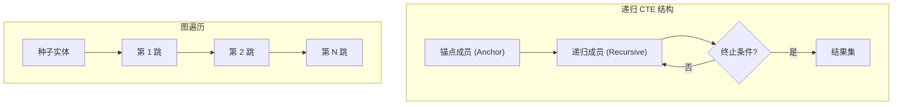
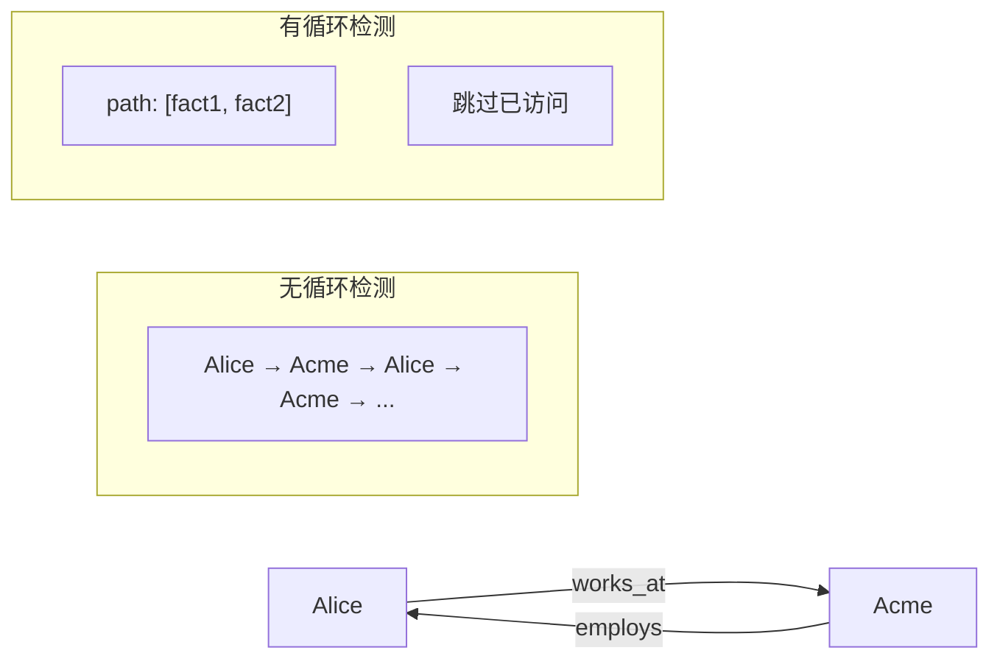
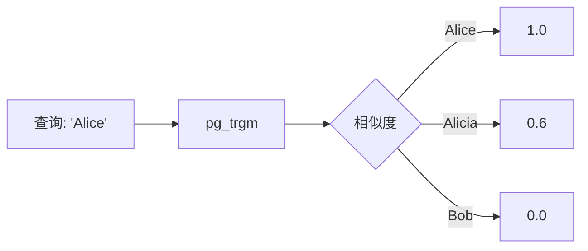
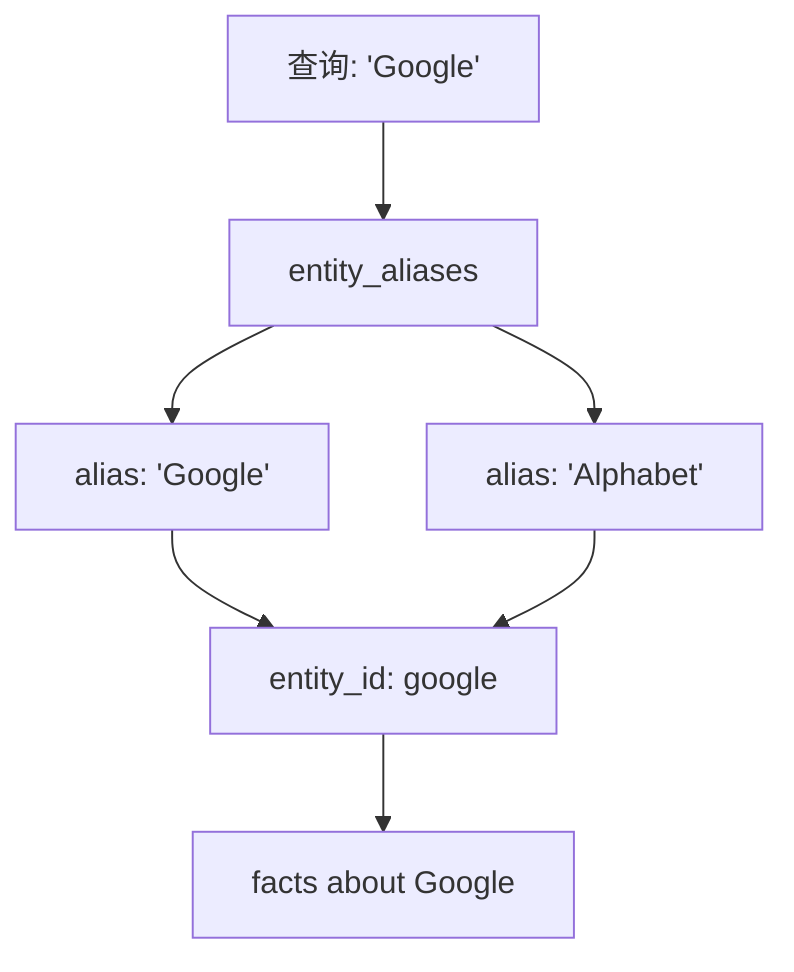
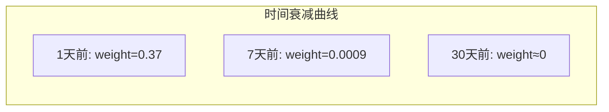

# 第7章 检索通道详解

## 向量通道深度解析

### pgvector HNSW 索引

```sql
-- 创建 HNSW 索引
CREATE INDEX idx_entities_embedding ON entities 
    USING hnsw (embedding vector_cosine_ops) 
    WITH (m = 16, ef_construction = 64);
```



### 向量查询优化

```python
def _chan_vector(conn, scope, view, q_emb, top_k):
    """优化的向量查询"""
    
    # 使用 CTE 避免多次扫描
    sql = """
        WITH near AS (
            -- 先找最近实体 (利用 HNSW 索引)
            SELECT entity_id, 
                   1 - (embedding <=> CAST(:q AS vector)) as sim
            FROM entities
            WHERE merged_into IS NULL 
              AND embedding IS NOT NULL 
              AND scope = :s
            ORDER BY embedding <=> CAST(:q AS vector)
            LIMIT :k
        )
        -- 再找相关 facts
        SELECT DISTINCT f.fact_id::text
        FROM facts f
        WHERE f.scope = :s
          AND f.valid_to IS NULL
          AND f.recorded_to IS NULL
          AND (
            f.subject_id IN (SELECT entity_id FROM near)
            OR f.object_entity_id IN (SELECT entity_id FROM near)
          )
        LIMIT :k
    """
    
    return [r[0] for r in conn.execute(text(sql), {
        "q": str(q_emb), "s": scope, "k": top_k
    }).fetchall()]
```

## BM25 通道深度解析

### tsvector 全文检索

```sql
-- facts 表的 tsvector 列
content_tsv tsvector GENERATED ALWAYS AS (
    to_tsvector('english', predicate || ' ' || 
                COALESCE(object_value->>'value', ''))
) STORED
```



### BM25 排序

```python
def _chan_bm25(conn, scope, view, query, top_k):
    """BM25 通道带排序"""
    sql = """
        SELECT 
            fact_id::text,
            ts_rank(content_tsv, q) as rank
        FROM facts,
             plainto_tsquery('english', :q) q
        WHERE scope = :s
          AND valid_to IS NULL
          AND recorded_to IS NULL
          AND content_tsv @@ q
        ORDER BY rank DESC
        LIMIT :k
    """
    
    return [r[0] for r in conn.execute(text(sql), {
        "s": scope, "q": query, "k": top_k
    }).fetchall()]
```

## 图遍历通道深度解析

### 递归 CTE 解析



### 完整图遍历实现

```python
def _chan_graph(conn, scope, view, q_emb, top_k, max_hops=2):
    """图遍历通道: 完整实现"""
    
    sql = """
        WITH RECURSIVE 
        -- 1. 种子: 向量最近的 5 个实体
        seeds AS (
            SELECT entity_id
            FROM entities
            WHERE merged_into IS NULL 
              AND embedding IS NOT NULL 
              AND scope = :s
            ORDER BY embedding <=> CAST(:q AS vector)
            LIMIT 5
        ),
        
        -- 2. 递归 BFS
        graph_walk AS (
            -- 锚点: 种子直接关联的 facts
            SELECT 
                f.fact_id,
                f.subject_id,
                f.object_entity_id,
                0 as depth,
                ARRAY[f.fact_id] as path  -- 防止循环
            FROM facts f
            JOIN seeds s ON (
                f.subject_id = s.entity_id 
                OR f.object_entity_id = s.entity_id
            )
            WHERE f.scope = :s
              AND f.valid_to IS NULL
              AND f.recorded_to IS NULL
            
            UNION ALL
            
            -- 递归: 扩展到下一跳
            SELECT 
                f.fact_id,
                f.subject_id,
                f.object_entity_id,
                gw.depth + 1,
                gw.path || f.fact_id
            FROM facts f
            JOIN graph_walk gw ON (
                -- 四种连接方式
                f.subject_id = gw.object_entity_id 
                OR f.object_entity_id = gw.subject_id
                OR f.subject_id = gw.subject_id
                OR f.object_entity_id = gw.object_entity_id
            )
            WHERE gw.depth < :hops
              AND f.scope = :s
              AND f.valid_to IS NULL
              AND f.recorded_to IS NULL
              AND f.fact_id != ALL(gw.path)  -- 防止循环
        )
        
        -- 3. 去重返回
        SELECT DISTINCT fact_id::text 
        FROM graph_walk
        ORDER BY depth  -- 近的优先
        LIMIT :k
    """
    
    return [r[0] for r in conn.execute(text(sql), {
        "s": scope, "q": str(q_emb), 
        "k": top_k, "hops": max_hops
    }).fetchall()]
```

### 防止循环



## Entity Name 通道深度解析

### pg_trgm 模糊匹配

```sql
-- 启用 pg_trgm 扩展
CREATE EXTENSION IF NOT EXISTS pg_trgm;

-- 创建 trgm 索引
CREATE INDEX idx_entities_name_trgm ON entities 
    USING gin (canonical_name gin_trgm_ops);
```



### 查询实现

```python
def _chan_entity_name(conn, scope, view, query, top_k):
    """Entity Name 通道"""
    sql = """
        SELECT DISTINCT f.fact_id::text
        FROM facts f
        JOIN entities e ON (
            f.subject_id = e.entity_id 
            OR f.object_entity_id = e.entity_id
        )
        WHERE f.scope = :s
          AND f.valid_to IS NULL
          AND e.canonical_name % :q  -- pg_trgm 匹配
        ORDER BY similarity(e.canonical_name, :q) DESC
        LIMIT :k
    """
    
    return [r[0] for r in conn.execute(text(sql), {
        "s": scope, "q": query, "k": top_k
    }).fetchall()]
```

## Synonym 通道深度解析

### 别名匹配



### 查询实现

```python
def _chan_synonym(conn, scope, view, query, top_k):
    """Synonym 通道: 别名匹配"""
    sql = """
        WITH matched_entities AS (
            SELECT DISTINCT entity_id
            FROM entity_aliases
            WHERE alias % :q
            ORDER BY similarity(alias, :q) DESC
            LIMIT 10
        )
        SELECT DISTINCT f.fact_id::text
        FROM facts f
        JOIN matched_entities me ON (
            f.subject_id = me.entity_id 
            OR f.object_entity_id = me.entity_id
        )
        WHERE f.scope = :s
          AND f.valid_to IS NULL
        LIMIT :k
    """
    
    return [r[0] for r in conn.execute(text(sql), {
        "s": scope, "q": query, "k": top_k
    }).fetchall()]
```

## Temporal 通道深度解析

### 时间衰减函数



### 衰减公式

```python
# 指数衰减: e^(-t/τ)
# τ = 86400 秒 (1天)
weight = exp(-age_seconds / 86400.0)
```

### 查询实现

```python
def _chan_temporal(conn, scope, view, top_k):
    """Temporal 通道: 时间衰减"""
    sql = """
        SELECT 
            fact_id::text,
            EXP(
                -EXTRACT(EPOCH FROM (now() - recorded_from)) / 86400.0
            ) as temporal_weight
        FROM facts
        WHERE scope = :s
          AND valid_to IS NULL
          AND recorded_to IS NULL
        ORDER BY temporal_weight DESC, recorded_from DESC
        LIMIT :k
    """
    
    return [r[0] for r in conn.execute(text(sql), {
        "s": scope, "k": top_k
    }).fetchall()]
```

## 通道权重配置

### 默认权重

```python
# config.py
class RetrievalCfg(BaseModel):
    top_k: int = 40
    rrf_k: float = 60.0
    graph_weight: float = 0.20
    graph_max_hops: int = 2
```

### 自定义权重

```python
# 可以通过 advanced 配置调整
class AdvancedRetrievalCfg(BaseModel):
    hyde_enabled: bool = False      # HyDE
    multihop_enabled: bool = False  # 多跳推理
    salience_weight: float = 0.0    # 显著性权重
```

## 性能对比

| 通道 | 查询时间 | 准确率 | 适用场景 |
|------|----------|--------|----------|
| 向量 | ~10ms | 中 | 语义相似 |
| BM25 | ~5ms | 高 | 精确匹配 |
| 图遍历 | ~50ms | 高 | 关系推理 |
| Entity Name | ~3ms | 中 | 名称匹配 |
| Synonym | ~5ms | 中 | 别名扩展 |
| Temporal | ~3ms | 低 | 近期优先 |
