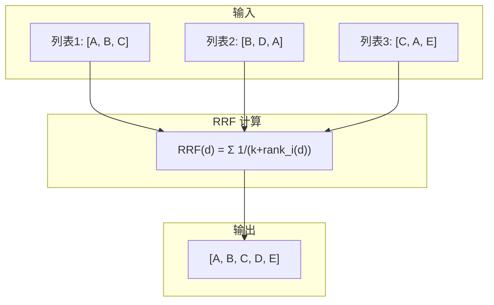
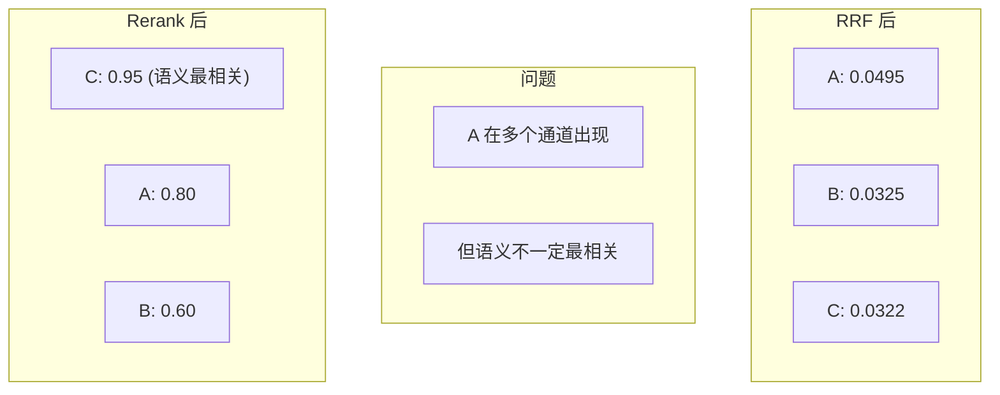
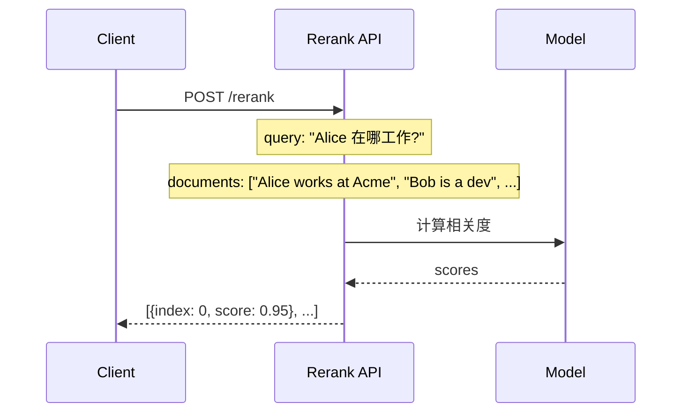
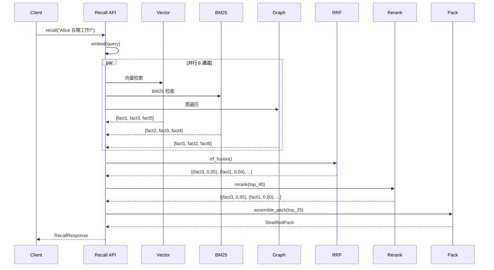

# 第8章 RRF 融合与 Rerank

## RRF (Reciprocal Rank Fusion)

### 原理

RRF 是一种**无参数**的排序融合算法，用于合并多个排序列表。



### 公式

```
RRF_score(d) = Σ 1 / (k + rank_i(d))
```

其中：
- `d` 是文档
- `k` 是常数 (通常 60)
- `rank_i(d)` 是文档 d 在第 i 个列表中的排名

### 实现

```python
def rrf_fusion(results, k=60.0):
    """RRF 融合多个排序列表
    
    Args:
        results: [(channel_name, [doc_ids]), ...]
        k: RRF 常数 (默认 60)
    
    Returns:
        [(doc_id, score), ...] 按 score 降序
    """
    scores = {}
    
    for channel_name, doc_ids in results:
        for rank, doc_id in enumerate(doc_ids, 1):
            if doc_id not in scores:
                scores[doc_id] = 0.0
            scores[doc_id] += 1.0 / (k + rank)
    
    # 按 score 降序排序
    sorted_docs = sorted(scores.items(), key=lambda x: x[1], reverse=True)
    
    return sorted_docs
```

### 示例

```python
# 3 个通道的结果
results = [
    ("vector", ["A", "B", "C"]),
    ("bm25", ["B", "D", "A"]),
    ("graph", ["C", "A", "E"])
]

# RRF 融合 (k=60)
scores = {
    "A": 1/(60+1) + 1/(60+3) + 1/(60+2),  # = 0.0495
    "B": 1/(60+2) + 1/(60+1),              # = 0.0325
    "C": 1/(60+3) + 1/(60+1),              # = 0.0322
    "D": 1/(60+2),                          # = 0.0161
    "E": 1/(60+3)                           # = 0.0159
}

# 排序: A > B > C > D > E
```

## 完整 RRF 融合实现

```python
# retrieval/pipeline.py
def rrf_fusion(results, k=60.0, graph_weight=0.20):
    """RRF 融合，支持通道权重"""
    scores = {}
    
    for channel_name, doc_ids in results:
        # 通道权重
        weight = graph_weight if channel_name == "graph" else 1.0
        
        for rank, doc_id in enumerate(doc_ids, 1):
            if doc_id not in scores:
                scores[doc_id] = 0.0
            scores[doc_id] += weight / (k + rank)
    
    sorted_docs = sorted(scores.items(), key=lambda x: x[1], reverse=True)
    return sorted_docs
```

## 取 Top-N

```python
def take_top_n(fused_results, n):
    """取融合后的 top-N"""
    return [doc_id for doc_id, score in fused_results[:n]]
```

## Rerank

### 为什么需要 Rerank?



### Prism Rerank



### 实现

```python
# services.py
def rerank(query, documents, cfg=None):
    """调 Prism Rerank"""
    cfg = cfg or load_config().rerank
    url = cfg.api_base.rstrip("/") + "/rerank"
    
    with httpx.Client(timeout=cfg.timeout) as cli:
        r = cli.post(url, json={
            "model": cfg.model,
            "query": query,
            "documents": documents,
            "top_n": cfg.top_n
        }, headers={
            "Authorization": f"Bearer {cfg.api_key}"
        })
        r.raise_for_status()
        out = r.json()
    
    results = out.get("results") or out.get("data") or []
    results.sort(key=lambda d: d.get("relevance_score", 0), reverse=True)
    
    return results
```

### 在检索管线中使用

```python
def rerank_results(conn, query, fact_ids, top_n=25):
    """对融合结果做 rerank"""
    if not fact_ids:
        return []
    
    # 1. 获取 facts 的文本表示
    documents = []
    for fid in fact_ids:
        fact = fetch_fact(conn, fid)
        text = f"{fact.subject_name} {fact.predicate} {fact.object_value}"
        documents.append(text)
    
    # 2. 调 rerank
    cfg = load_config().rerank
    reranked = services.rerank(query, documents, cfg)
    
    # 3. 取 top_n
    result = []
    for item in reranked[:top_n]:
        idx = item["index"]
        score = item["relevance_score"]
        if score >= cfg.threshold:
            result.append((fact_ids[idx], score))
    
    return result
```

## 完整检索流程



## 通道权重调优

### 默认权重

| 通道 | 权重 | 说明 |
|------|------|------|
| vector | 1.0 | 语义相似 |
| bm25 | 1.0 | 精确匹配 |
| graph | 0.20 | 关系推理 (配置可调) |
| entity_name | 1.0 | 名称匹配 |
| synonym | 1.0 | 别名扩展 |
| temporal | 1.0 | 时间衰减 |

### 调优建议

```python
# 根据场景调整权重
# 1. 精确查询场景: 提高 BM25 权重
# 2. 语义查询场景: 提高向量权重
# 3. 关系查询场景: 提高图遍历权重

class RetrievalCfg(BaseModel):
    graph_weight: float = 0.20  # 可调
```

## 性能优化

### 索引优化

```sql
-- 向量索引 (HNSW)
CREATE INDEX idx_entities_embedding ON entities 
    USING hnsw (embedding vector_cosine_ops) 
    WITH (m = 16, ef_construction = 64);

-- BM25 索引 (GIN)
CREATE INDEX idx_facts_tsv ON facts USING gin (content_tsv);

-- 图遍历索引 (B-tree)
CREATE INDEX idx_facts_subject ON facts (subject_id);
CREATE INDEX idx_facts_object ON facts (object_entity_id);
```

### 查询优化

```python
# 1. 并行执行各通道
import concurrent.futures

with concurrent.futures.ThreadPoolExecutor() as executor:
    futures = {
        executor.submit(_chan_vector, ...): "vector",
        executor.submit(_chan_bm25, ...): "bm25",
        executor.submit(_chan_graph, ...): "graph",
    }
    
    results = []
    for future in concurrent.futures.as_completed(futures):
        channel = futures[future]
        doc_ids = future.result()
        results.append((channel, doc_ids))

# 2. 限制图遍历深度
graph_max_hops = 2  # 避免过深遍历

# 3. 提前终止
top_k = 40  # 每个通道最多返回 40 个
```
