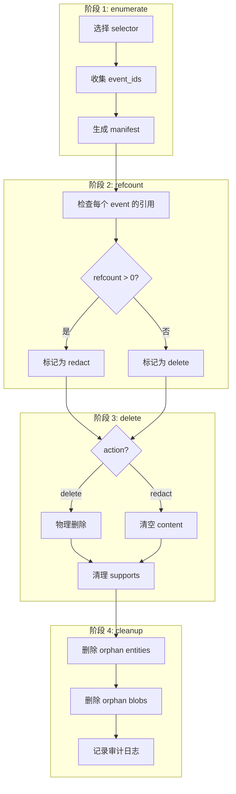
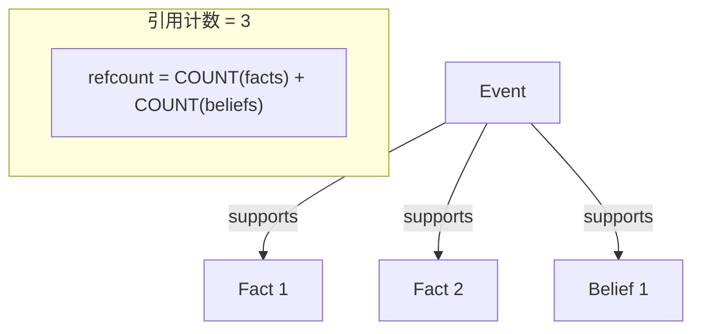
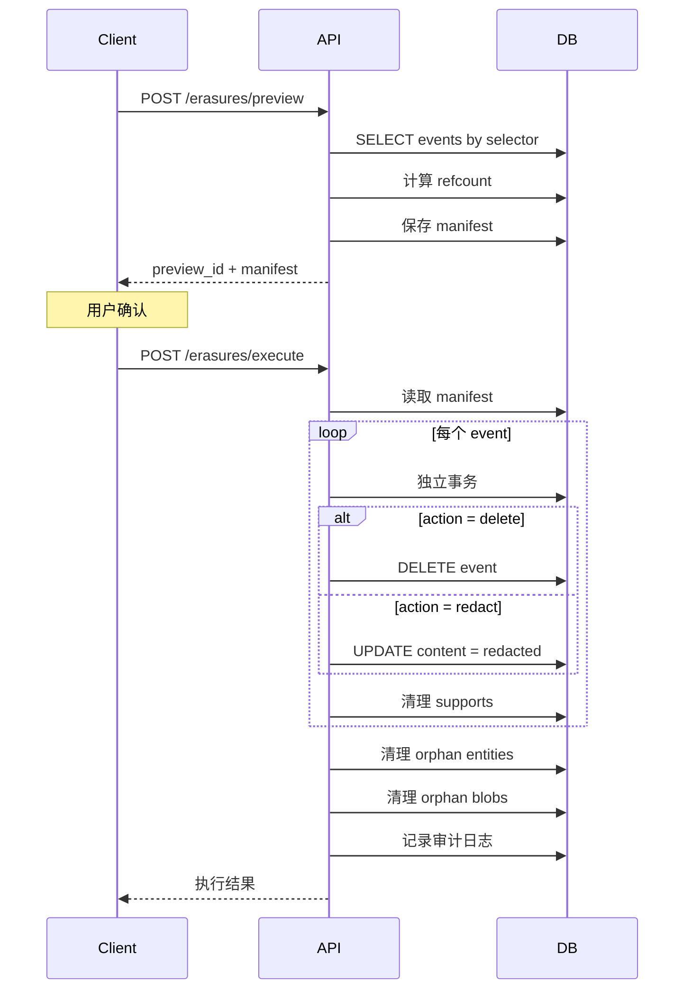

# 第12章 Erasure 系统 (GDPR)

## 设计目标

支持 **GDPR "被遗忘权"**，真正删除数据，而不是软删除。

```{admonition} 关键约束
1. **引用计数** —— 被引用的数据不能直接删
2. **4 阶段流程** —— enumerate → refcount → delete → cleanup
3. **每 event 独立事务** —— 避免 PG tx 中毒
4. **manifest 预览** —— 先看会删什么，再执行
```

## 4 阶段流程



## Selector 选择器

### 支持的 Selector

```python
# erasures.py
selector = {
    "memory_ids": ["event_id_1", "event_id_2"],  # 直接指定
    "about_entity": "entity_id",                   # 按实体
    "predicate": "works_at"                        # 按谓词
}
```

### 实现

```python
def _select_event_ids(conn, scope, selector):
    """根据 selector 收集命中的 event_id"""
    ids = []
    
    # 1. 直接指定的 memory_ids
    if selector.get("memory_ids"):
        ids.extend(selector["memory_ids"])
    
    # 2. 按实体查找
    cond = ""
    params = {"s": scope}
    
    if selector.get("about_entity"):
        cond += " AND (f.subject_id = CAST(:a AS uuid) OR f.object_entity_id = CAST(:a AS uuid))"
        params["a"] = selector["about_entity"]
    
    if selector.get("predicate"):
        cond += " AND f.predicate = :p"
        params["p"] = selector["predicate"]
    
    # 通过 facts.supports 反查 event_ids
    if cond:
        rows = conn.execute(text(f"""
            SELECT DISTINCT unnest(f.supports)::text 
            FROM facts f
            WHERE f.scope = :s {cond}
        """), params).fetchall()
        ids.extend(r[0] for r in rows)
    
    # 去重 + 验证存在性
    if not ids:
        return []
    
    rows = conn.execute(text("""
        SELECT event_id::text 
        FROM events 
        WHERE scope = :s 
          AND event_id = ANY(CAST(:ids AS uuid[]))
    """), {"s": scope, "ids": "{" + ",".join(ids) + "}"}).fetchall()
    
    return list({r[0] for r in rows})
```

## 引用计数

### 原理



### 实现

```python
def _event_refcount(conn, scope, event_id):
    """计算 event 被引用的次数"""
    return conn.execute(text("""
        SELECT 
            (SELECT count(*) FROM facts WHERE scope = :s AND CAST(:e AS uuid) = ANY(supports))
            +
            (SELECT count(*) FROM beliefs WHERE scope = :s AND CAST(:e AS uuid) = ANY(supports))
    """), {"s": scope, "e": event_id}).scalar() or 0
```

## Manifest 预览

### 生成 Manifest

```python
def preview_erasure(*, scope, selector):
    """生成 erasure manifest 预览"""
    with session_scope() as conn:
        # 1. 收集 event_ids
        eids = _select_event_ids(conn, scope, selector)
        
        manifest_entries = []
        n_del = n_red = 0
        
        for eid in eids:
            # 2. 计算引用计数
            rc = _event_refcount(conn, scope, eid)
            
            # 3. 决定 action
            action = "redact" if rc > 0 else "delete"
            
            if action == "redact":
                n_red += 1
            else:
                n_del += 1
            
            manifest_entries.append({
                "event_id": eid,
                "action": action,
                "refcount": rc
            })
        
        # 4. 保存 manifest
        preview_id = uuid.uuid4()
        manifest = {
            "events": manifest_entries,
            "expires_at": (datetime.now(timezone.utc) + 
                          timedelta(hours=MANIFEST_TTL_HOURS)).isoformat()
        }
        
        conn.execute(text("""
            INSERT INTO erasure_jobs (preview_id, scope, selector, manifest, phase)
            VALUES (:pid, :s, CAST(:sel AS jsonb), CAST(:m AS jsonb), 'preview')
        """), {
            "pid": preview_id,
            "s": scope,
            "sel": json.dumps(selector),
            "m": json.dumps(manifest)
        })
        
        return {
            "preview_id": str(preview_id),
            "total_events": len(eids),
            "to_delete": n_del,
            "to_redact": n_red,
            "manifest": manifest
        }
```

### Manifest 结构

```json
{
    "preview_id": "uuid",
    "total_events": 10,
    "to_delete": 7,
    "to_redact": 3,
    "manifest": {
        "events": [
            {
                "event_id": "uuid1",
                "action": "delete",
                "refcount": 0
            },
            {
                "event_id": "uuid2",
                "action": "redact",
                "refcount": 2
            }
        ],
        "expires_at": "2024-01-02T00:00:00Z"
    }
}
```

## 执行删除

### 4 阶段实现

```python
def execute_erasure(*, scope, preview_id):
    """执行 erasure"""
    with session_scope() as conn:
        # 读取 manifest
        job = conn.execute(text("""
            SELECT manifest FROM erasure_jobs 
            WHERE preview_id = :pid AND phase = 'preview'
        """), {"pid": preview_id}).fetchone()
        
        if not job:
            raise ValueError("preview not found or expired")
        
        manifest = job.manifest
        
        # 阶段 3: 执行删除
        for entry in manifest["events"]:
            eid = entry["event_id"]
            action = entry["action"]
            
            # 每个 event 独立事务
            with session_scope() as event_conn:
                if action == "delete":
                    # 物理删除
                    _delete_event(event_conn, scope, eid)
                else:
                    # redact: 清空 content
                    _redact_event(event_conn, scope, eid)
                
                # 清理 supports 引用
                _clean_supports(event_conn, scope, eid)
        
        # 阶段 4: 清理 orphan
        _cleanup_orphan_entities(conn, scope)
        _cleanup_orphan_blobs(conn, scope)
        
        # 记录审计日志
        _audit_log(conn, scope, preview_id, manifest)
        
        return {"executed": len(manifest["events"])}
```

### 删除 Event

```python
def _delete_event(conn, scope, event_id):
    """物理删除 event"""
    conn.execute(text("""
        DELETE FROM events 
        WHERE scope = :s AND event_id = :e
    """), {"s": scope, "e": event_id})
```

### Redact Event

```python
def _redact_event(conn, scope, event_id):
    """Redact event (清空 content，保留 id)"""
    conn.execute(text("""
        UPDATE events 
        SET 
            content = '{"redacted": true}'::jsonb,
            context = '{"redacted": true}'::jsonb,
            excluded_from_recall = true
        WHERE scope = :s AND event_id = :e
    """), {"s": scope, "e": event_id})
```

### 清理 supports

```python
def _clean_supports(conn, scope, event_id):
    """从 facts/beliefs.supports 中移除引用"""
    # 从 facts.supports 移除
    conn.execute(text("""
        UPDATE facts 
        SET supports = array_remove(supports, CAST(:e AS uuid))
        WHERE scope = :s AND CAST(:e AS uuid) = ANY(supports)
    """), {"s": scope, "e": event_id})
    
    # 从 beliefs.supports 移除
    conn.execute(text("""
        UPDATE beliefs 
        SET supports = array_remove(supports, CAST(:e AS uuid))
        WHERE scope = :s AND CAST(:e AS uuid) = ANY(supports)
    """), {"s": scope, "e": event_id})
```

## Orphan 清理

### Orphan Entity

```python
def _cleanup_orphan_entities(conn, scope):
    """删除没有引用的 entities"""
    conn.execute(text("""
        DELETE FROM entities 
        WHERE scope = :s 
          AND merged_into IS NULL
          AND entity_id NOT IN (
            SELECT DISTINCT subject_id FROM facts WHERE scope = :s
            UNION
            SELECT DISTINCT object_entity_id FROM facts WHERE scope = :s
            UNION
            SELECT DISTINCT about_entity_id FROM beliefs WHERE scope = :s
          )
    """), {"s": scope})
```

### Orphan Blob

```python
def _cleanup_orphan_blobs(conn, scope):
    """删除没有引用的 blobs"""
    conn.execute(text("""
        DELETE FROM blobs 
        WHERE scope = :s 
          AND refcount <= 0
    """), {"s": scope})
```

## 完整流程图



## 配置

```python
# config.py 中没有专门的 erasure 配置
# 但有一些常量

MANIFEST_TTL_HOURS = 24  # manifest 有效期
```

## 安全考虑

1. **不可逆** —— 物理删除后无法恢复
2. **审计日志** —— 记录所有删除操作
3. **manifest 预览** —— 先看再删
4. **独立事务** —— 避免部分删除
