# 第13章 架构图汇总

## 系统整体架构

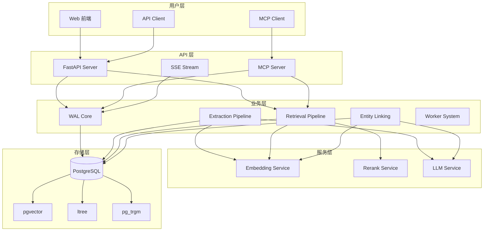
```mermaid
graph TB
    subgraph "用户层"
        U1[Web 前端]
        U2[MCP Client]
        U3[API Client]
    end
    
    subgraph "API 层"
        A1[FastAPI Server]
        A2[MCP Server]
        A3[SSE Stream]
    end
    
    subgraph "业务层"
        B1[WAL Core]
        B2[Extraction Pipeline]
        B3[Retrieval Pipeline]
        B4[Entity Linking]
        B5[Worker System]
    end
    
    subgraph "服务层"
        S1[Embedding Service]
        S2[Rerank Service]
        S3[LLM Service]
    end
    
    subgraph "存储层"
        D1[(PostgreSQL)]
        D2[pgvector]
        D3[ltree]
        D4[pg_trgm]
    end
    
    U1 --> A1
    U2 --> A2
    U3 --> A1
    
    A1 --> B1
    A1 --> B3
    A2 --> B1
    A2 --> B3
    A3 --> B1
    
    B1 --> D1
    B2 --> D1
    B3 --> D1
    B4 --> D1
    
    B2 --> S1
    B2 --> S3
    B3 --> S1
    B3 --> S2
    B4 --> S1
    B4 --> S3
    
    D1 --> D2
    D1 --> D3
    D1 --> D4
```

## 写入路径

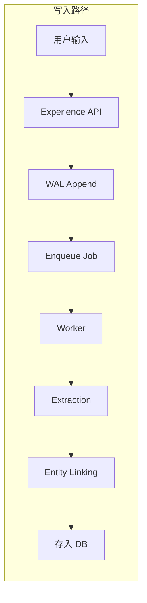
```mermaid
flowchart LR
    subgraph "写入路径"
        A[用户输入] --> B[Experience API]
        B --> C[WAL Append]
        C --> D[Enqueue Job]
        D --> E[Worker]
        E --> F[Extraction]
        F --> G[Entity Linking]
        G --> H[存入 DB]
    end
```

## 读取路径

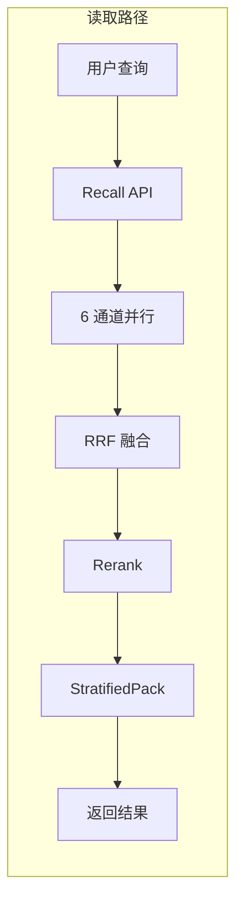
```mermaid
flowchart LR
    subgraph "读取路径"
        A[用户查询] --> B[Recall API]
        B --> C[6 通道并行]
        C --> D[RRF 融合]
        D --> E[Rerank]
        E --> F[StratifiedPack]
        F --> G[返回结果]
    end
```

## 6 通道检索架构

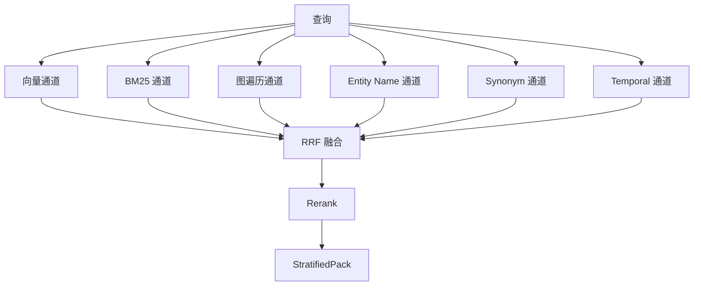
```mermaid
graph TB
    Q[查询] --> V[向量通道]
    Q --> B[BM25 通道]
    Q --> G[图遍历通道]
    Q --> N[Entity Name 通道]
    Q --> S[Synonym 通道]
    Q --> T[Temporal 通道]
    
    V --> RRF[RRF 融合]
    B --> RRF
    G --> RRF
    N --> RRF
    S --> RRF
    T --> RRF
    
    RRF --> R[Rerank]
    R --> P[StratifiedPack]
```

## 五层记忆模型

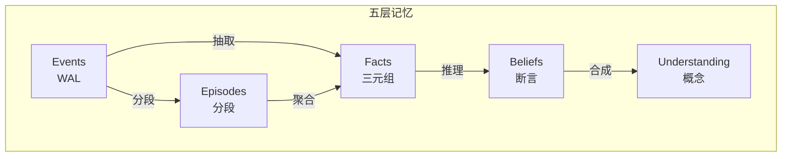
```mermaid
graph TB
    subgraph "五层记忆"
        E[Events<br/>WAL]
        EP[Episodes<br/>分段]
        F[Facts<br/>三元组]
        B[Beliefs<br/>断言]
        U[Understanding<br/>概念]
    end
    
    E -->|抽取| F
    E -->|分段| EP
    EP -->|聚合| F
    F -->|推理| B
    B -->|合成| U
```

## 实体链接 B over C

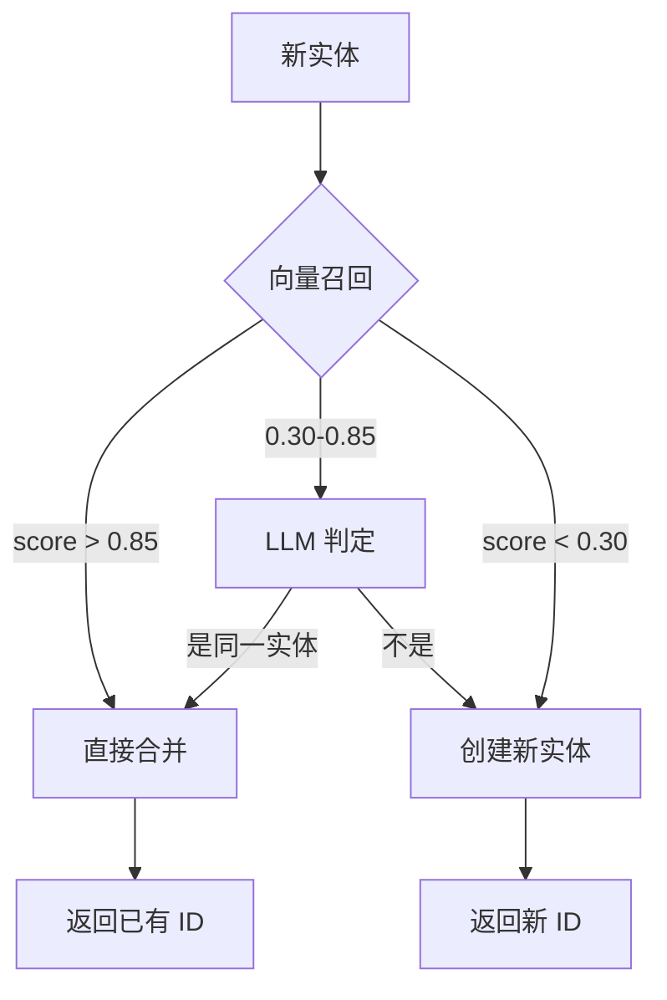
```mermaid
flowchart TD
    A[新实体] --> B{向量召回}
    B -->|score > 0.85| C[直接合并]
    B -->|0.30-0.85| D[LLM 判定]
    B -->|score < 0.30| E[创建新实体]
    
    D -->|是同一实体| C
    D -->|不是| E
    
    C --> F[返回已有 ID]
    E --> G[返回新 ID]
```

## Worker 系统

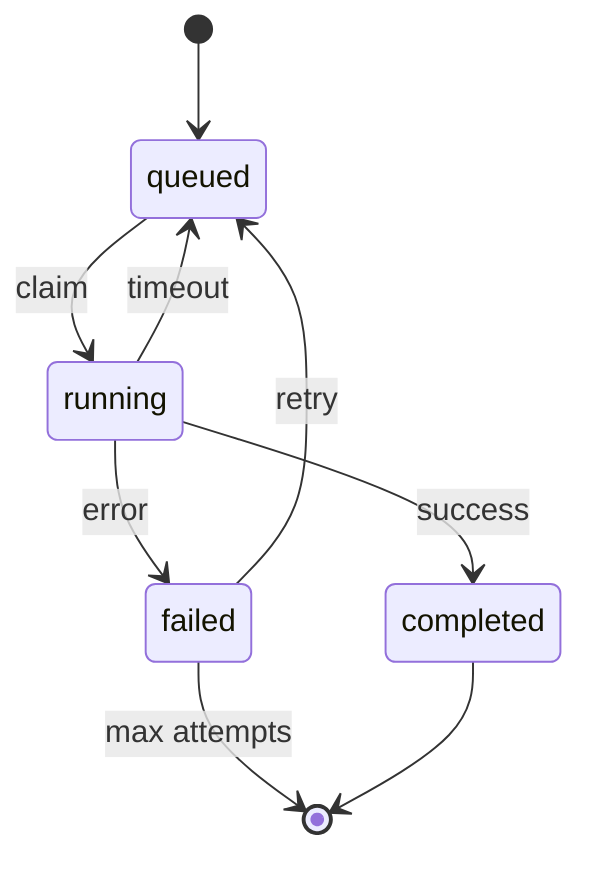
```mermaid
stateDiagram-v2
    [*] --> queued
    queued --> running: claim
    running --> completed: success
    running --> failed: error
    running --> queued: timeout
    failed --> queued: retry
    failed --> [*]: max attempts
    completed --> [*]
```

## 双时态模型

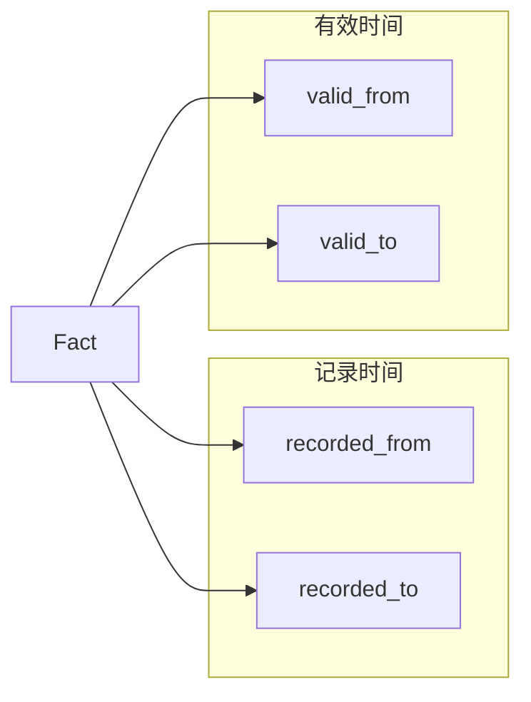
```mermaid
graph LR
    subgraph "记录时间"
        RT1[recorded_from]
        RT2[recorded_to]
    end
    
    subgraph "有效时间"
        VT1[valid_from]
        VT2[valid_to]
    end
    
    F[Fact] --> RT1
    F --> RT2
    F --> VT1
    F --> VT2
```

## 数据流

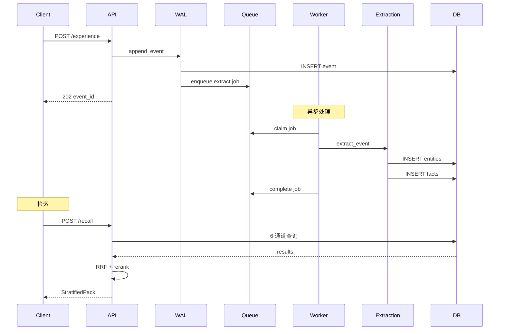
```mermaid
sequenceDiagram
    participant C as Client
    participant API as API
    participant WAL as WAL
    participant Q as Queue
    participant W as Worker
    participant EXT as Extraction
    participant DB as DB
    
    C->>API: POST /experience
    API->>WAL: append_event
    WAL->>DB: INSERT event
    WAL->>Q: enqueue extract job
    API-->>C: 202 event_id
    
    Note over W: 异步处理
    
    W->>Q: claim job
    W->>EXT: extract_event
    EXT->>DB: INSERT entities
    EXT->>DB: INSERT facts
    W->>Q: complete job
    
    Note over C: 检索
    
    C->>API: POST /recall
    API->>DB: 6 通道查询
    DB-->>API: results
    API->>API: RRF + rerank
    API-->>C: StratifiedPack
```

## 组件交互

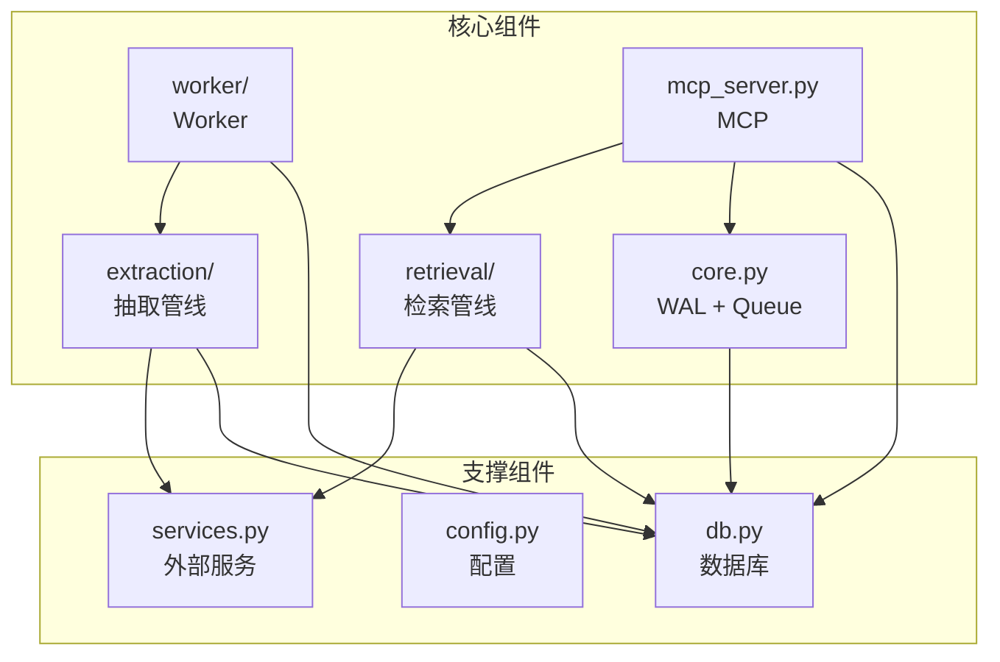
```mermaid
graph TB
    subgraph "核心组件"
        CORE[core.py<br/>WAL + Queue]
        EXT[extraction/<br/>抽取管线]
        RET[retrieval/<br/>检索管线]
        WORK[worker/<br/>Worker]
        MCP[mcp_server.py<br/>MCP]
    end
    
    subgraph "支撑组件"
        SVC[services.py<br/>外部服务]
        CFG[config.py<br/>配置]
        DB[db.py<br/>数据库]
    end
    
    CORE --> DB
    EXT --> DB
    RET --> DB
    WORK --> DB
    MCP --> DB
    
    EXT --> SVC
    RET --> SVC
    MCP --> CORE
    MCP --> RET
    WORK --> EXT
```

## 层级 Scope

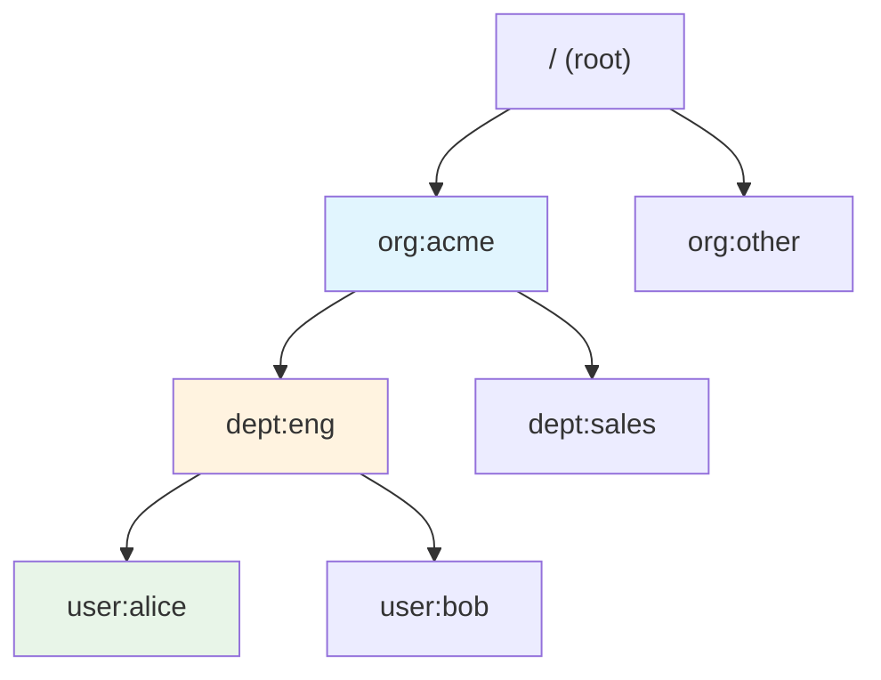
```mermaid
graph TB
    R["/ (root)"] --> O1["org:acme"]
    R --> O2["org:other"]
    O1 --> D1["dept:eng"]
    O1 --> D2["dept:sales"]
    D1 --> U1["user:alice"]
    D1 --> U2["user:bob"]
    
    style O1 fill:#e1f5fe
    style D1 fill:#fff3e0
    style U1 fill:#e8f5e8
```

## MCP 双传输

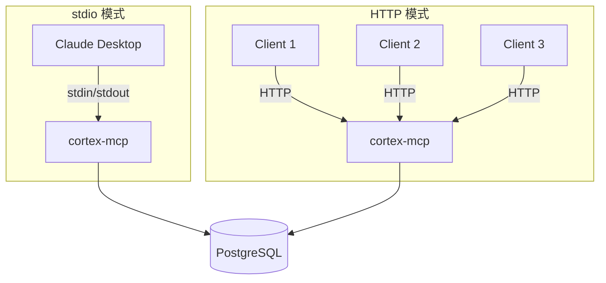
```mermaid
graph TB
    subgraph "stdio 模式"
        S1[Claude Desktop] -->|stdin/stdout| M1[cortex-mcp]
    end
    
    subgraph "HTTP 模式"
        C1[Client 1] -->|HTTP| M2[cortex-mcp]
        C2[Client 2] -->|HTTP| M2
        C3[Client 3] -->|HTTP| M2
    end
    
    M1 --> DB[(PostgreSQL)]
    M2 --> DB
```

## 性能优化点

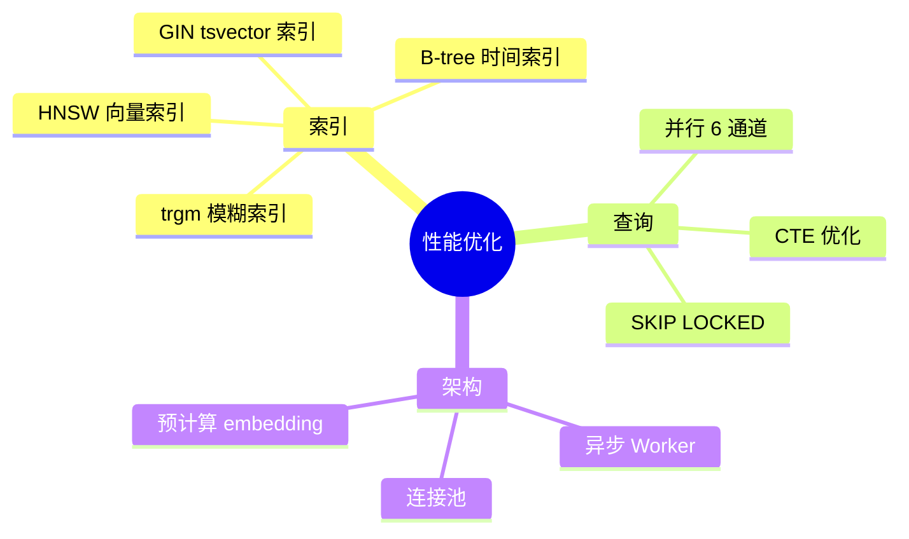
```mermaid
mindmap
    root((性能优化))
        索引
            HNSW 向量索引
            GIN tsvector 索引
            B-tree 时间索引
            trgm 模糊索引
        查询
            并行 6 通道
            CTE 优化
            SKIP LOCKED
        架构
            异步 Worker
            连接池
            预计算 embedding
```
